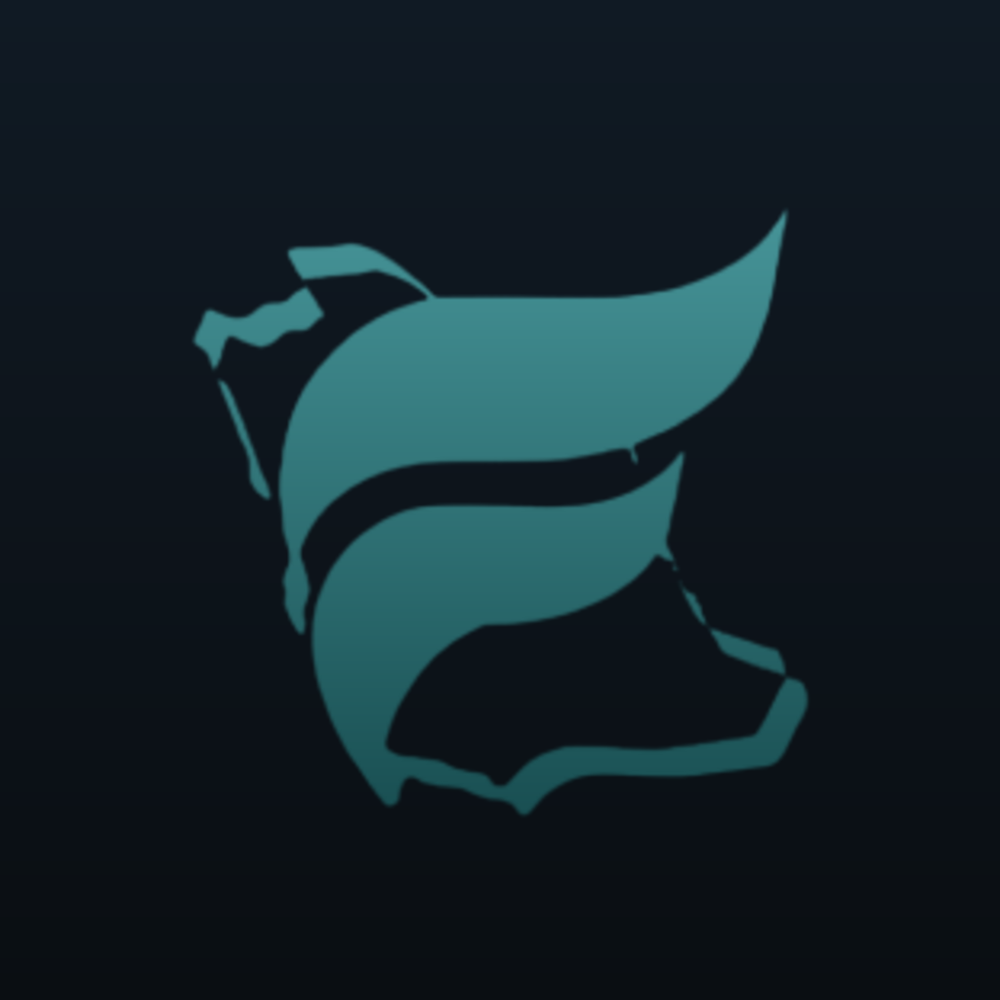

# Fly GACA — iOS App Family

<p>
  <a href="https://github.com/ay2m/FlyGACA/actions/workflows/ios.yml"></a>
  <a href="LICENSE"></a>
</p>

The native SwiftUI home of the Fly GACA study apps: **one shared Swift package
(`FlyGACAKit`), one App Store app per study module** — PPL, ELPT, AIP, CPL, IR
and ATPL — sold together via an App Store app bundle. Every app carries the same
offline feature set (study mode, quizzing, flashcards with spaced repetition,
mock tests and timed scored exam prep with analytics); a module is **data, not
code**.

<p align="center">
  
  
  
  
  
  
  <br /><sub>PPL · ELPT · AIP · CPL · IR · ATPL</sub>
</p>

This repo is the dedicated iOS workspace. The blueprint is
[`apple/ARCHITECTURE.md`](apple/ARCHITECTURE.md); the 10-minute Mac setup is
[`apple/README.md`](apple/README.md) (written from the monorepo's point of view —
see [Content](#content-committed-snapshots) below for how content works *here*).

## Quickstart (Mac, Xcode 16+)

```bash
npm run ios:generate        # XcodeGen → apple/FlyGACA.xcodeproj (installs xcodegen if missing)
open apple/FlyGACA.xcodeproj
# pick a scheme (PPL, ELPT, AIP, CPL, IR, ATPL) and run — fully offline

npm run ios:test            # swift test — FlyGACAKit unit + web-parity suites
npm run ios:build:ppl       # headless debug build (also: elpt aip cpl ir atpl / all)
```

The Xcode project is **generated, never committed** — `apple/project.yml` is the
source of truth. The package has zero external dependencies, so `swift build` /
`swift test` need no simulator and no SDK downloads.

## Layout

```
apple/
  ARCHITECTURE.md      the why — target graph, data contracts, App Store strategy
  README.md            the how — Mac setup, adding the next app
  project.yml          XcodeGen spec (one ~20-line target per app)
  FlyGACAKit/          the shared package: CoreModels · StudyEngines · ContentKit ·
                       PersistenceKit · AppServices · FeatureUI (+ full test suite)
  Apps/
    Shared/            FlyGACAApp.swift — THE app shell, shared by every target
    PPL/ ELPT/ AIP/ CPL/ IR/ ATPL/
                       per-app xcconfig (bundle id, module id, display name),
                       Assets.xcassets (app icon), Content/ (bundled module data)
  AppleTests/          simulator screenshot tests
  Scripts/             marketing screenshot pipeline (simulator + HTML fallback)
scripts/
  native/              ios-generate.sh · xcodebuild-wrapper.sh (build/archive/TestFlight)
  sync-content.sh      refresh content + icons from a FlyGACA-app clone (see below)
docs/                  RUNBOOK-ios-xcodebuild · RUNBOOK-ios-signing · RUNBOOK-ios-firebase
```

## Content: committed snapshots

Each app ships a `Content/` folder (`module.json`, `quiz.json`, plus ground
school and reading paths where the pack has them). The **source of truth for
content stays in the [FlyGACA-app](https://github.com/FlyGACA/FlyGACA-app)
monorepo** — the regulatory corpus (`public/data/`) and the pack catalog
(`src/lib/prepCatalog.ts`). In this repo the `Content/` folders are committed
snapshots. To refresh them (and the app icons, which are generated by the
monorepo's `npm run ios:icons`):

```bash
# with a FlyGACA-app clone next to this repo (or pass its path)
bash scripts/sync-content.sh [path-to-FlyGACA-app] [--all]
```

`--all` also syncs `FlyGACAKit/`, the shared shell, `project.yml` and the apple
docs, keeping the whole `apple/` tree tracking the monorepo. While
`FlyGACA-app/apple/` still exists there, treat the monorepo as canonical and
sync **monorepo → here**; once this repo is proven as the iOS home, the
monorepo copy can be retired.

## CI

`.github/workflows/ios.yml` (ported from the monorepo's iOS workflow) runs on
every push/PR: `swift test` for FlyGACAKit — including the cross-platform parity
vectors for spaced repetition and exam scoring; keep them green — an
`xcodegen generate` validation of `apple/project.yml`, and unsigned debug builds
of all six apps on macOS runners. Pushes to `main` additionally produce unsigned
release archives; the TestFlight upload job stays skipped until the signing
secrets exist (`docs/RUNBOOK-ios-signing.md`).

## The Fly GACA repos

| Repo | What it holds |
| --- | --- |
| **[ay2m/FlyGACA](https://github.com/ay2m/FlyGACA)** (this repo) | Native iOS app family — FlyGACAKit + the six app targets |
| [FlyGACA/FlyGACA-app](https://github.com/FlyGACA/FlyGACA-app) | flygaca.com — web app (React/Vite PWA), Firebase backend, regulatory corpus + content pipelines |
| [FlyGACA/Captain-Adel](https://github.com/FlyGACA/Captain-Adel) | Captain Adel — the AI flight-instructor service (captadel.com + the brain behind chat) |
| [FlyGACA/PPL](https://github.com/FlyGACA/PPL) · [CPL](https://github.com/FlyGACA/CPL) · [IR](https://github.com/FlyGACA/IR) · [ATPL](https://github.com/FlyGACA/ATPL) · [ELPT](https://github.com/FlyGACA/ELPT) · [AIP](https://github.com/FlyGACA/AIP) | Per-app App Store homes — store metadata (EN/AR), screenshots, per-app roadmap |
| [FlyGACA/Office](https://github.com/FlyGACA/Office) | The business operating system — strategy, governance, legal, finance, GTM docs |

The app lineup and wave plan live in the monorepo's
`docs/APPS-FAMILY-ROADMAP.md`; per-app store listings live in each app's repo.

## Disclaimer

**Fly GACA is an independent educational platform.** It is not affiliated with, endorsed by, or operated by the General Authority of Civil Aviation (GACA) or the Government of the Kingdom of Saudi Arabia. The official and authoritative source for all civil aviation regulations, publications, and aeronautical information is always GACA. Always verify against the latest official GACA publication at gaca.gov.sa.

<div dir="rtl">

**فلاي جاكا منصة تعليمية مستقلة.** وهي غير تابعة للهيئة العامة للطيران المدني (GACA) ولا معتمدة منها ولا تُديرها، كما أنها لا تمثّل حكومة المملكة العربية السعودية. المصدر الرسمي والمعتمد لجميع لوائح الطيران المدني ومنشوراته ومعلوماته الجوية هو GACA دائمًا. تحقّق دائمًا من أحدث منشور رسمي صادر عن GACA على gaca.gov.sa.

</div>

## License

[MIT](LICENSE) © BDA Company International (شركة بدع الدولية), operating as Fly GACA.
